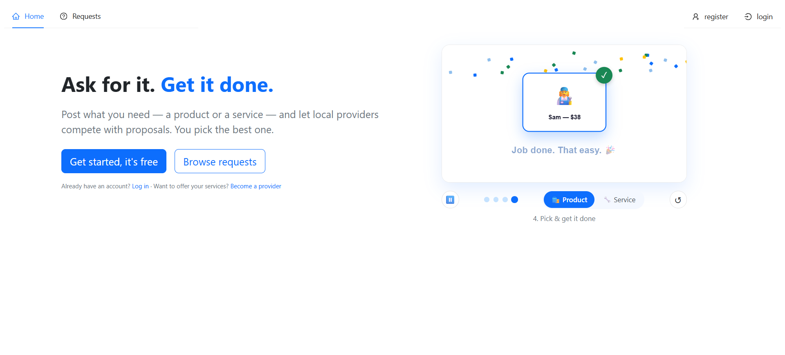
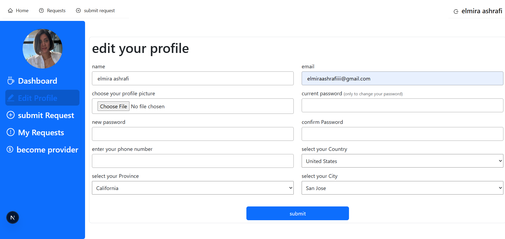
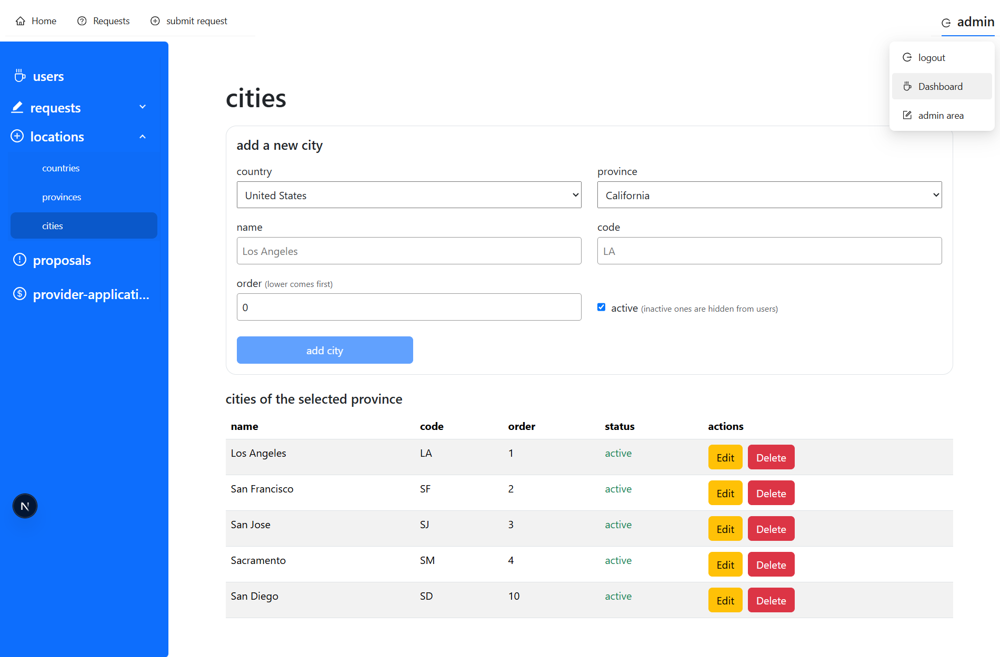

# MERN Service Marketplace

A local marketplace where requesters post requests for a **product** or a **service**, providers compete by submitting **proposals**, and the requester picks the one they like best. Providers must apply and be approved by an admin before they can submit proposals; requests are also moderated before going public.

## Live Demo
[mern.ashrafisolutions.com](https://mern.ashrafisolutions.com/)

## Screenshots

| Home | User Dashboard | Admin Dashboard |
|------|----------------|-----------------|
||||

## Tech stack

- **Client**: Next.js 16 (Pages Router), React 19, Ant Design, Bootstrap 5, Remotion (interactive homepage hero video)
- **Server**: Express 5, MongoDB / Mongoose, JWT auth via HTTP-only cookies, CSRF protection (`csurf`), Multer + Sharp for image uploads, Nodemailer for transactional email
- **Architecture**: The client runs its own small Express server (`client/server.js`) that serves the Next.js app and proxies `/api` and `/uploads` to the backend, so the browser only ever talks to a single origin.

## Project structure

```
client/   Next.js frontend (pages, components, context, lib)
server/   Express API (routes, controllers, models, middlewares)
```

Key domain models (`server/models/`):

| Model | Purpose |
|---|---|
| `user` | Accounts with roles: `Requester`, `Provider`, `Admin` |
| `request` | A requester's posted need (product or service), with category, location, images and admin moderation status |
| `proposal` | A provider's offer (price + content) against a request |
| `providerApplication` | A user's application to become an approved provider in a category/location |
| `category` | Hierarchical product/service category tree |

## Getting started

### Prerequisites

- Node.js 18+
- A MongoDB instance (local or hosted)

### 1. Server

```bash
cd server
npm install
```

Create `server/.env`:

```env
MONGODB=mongodb://127.0.0.1:27017/mern
JWT_SECRET=some-long-random-secret
PORT=8000
CLIENT_ORIGINS=http://127.0.0.1:3000,http://localhost:3000
UPLOAD_DIR=uploads
EMAIL_USER=your-gmail-address@gmail.com
GOOGLE_APP_PASSWORD=your-gmail-app-password
```

Run it:

```bash
npm run dev      # nodemon, auto-restarts
npm start        # plain node
```

To promote an existing user to Admin:

```bash
npm run make-admin
```

### 2. Client

```bash
cd client
npm install
```

Create `client/.env.local` if you need to override the API target:

```env
API_TARGET=http://127.0.0.1:8000
```

Run it:

```bash
npm run dev       # starts client/server.js, proxies /api and /uploads to the backend
npm run build
npm start         # production mode (node server.js --prod)
```

The app is served at `http://127.0.0.1:3000`.

## Core flow

1. A **requester** registers, then posts a request (product or service) with a category, location and optional images.
2. An **admin** moderates the request before it becomes visible.
3. Approved **providers** browse open requests and submit proposals (price + message, optional images).
4. The requester reviews proposals and accepts one; the request is marked assigned.
5. Users apply to become providers via a **provider application**, reviewed and approved by an admin.

## Scripts reference

| Location | Script | What it does |
|---|---|---|
| `server` | `npm run dev` | Start the API with nodemon |
| `server` | `npm start` | Start the API |
| `server` | `npm run make-admin` | Promote a user to the `Admin` role |
| `client` | `npm run dev` | Start the Next.js app behind its Express proxy |
| `client` | `npm run build` | Production build |
| `client` | `npm start` | Run the production build |
| `client` | `npm run lint` / `lint:fix` | ESLint |
